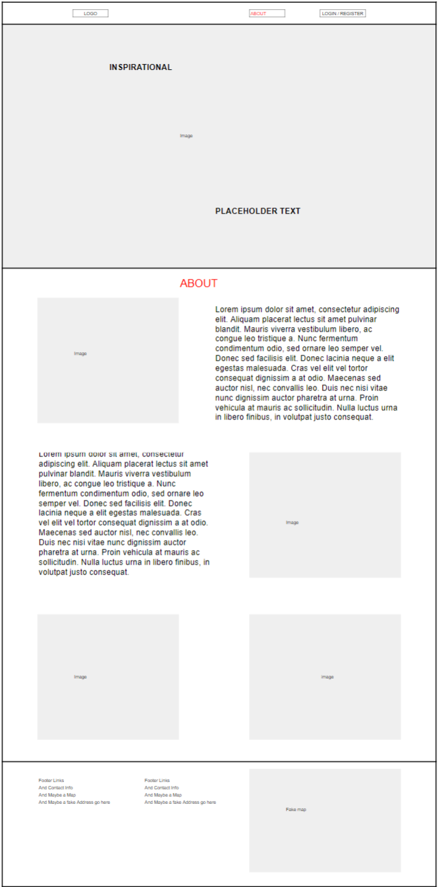
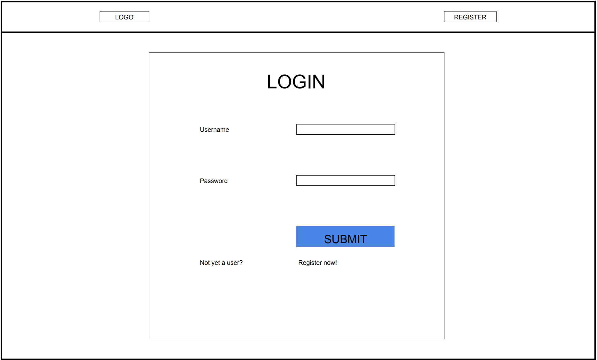
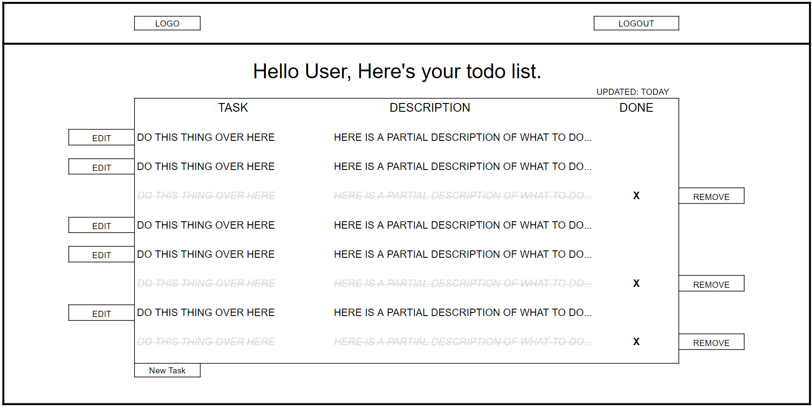
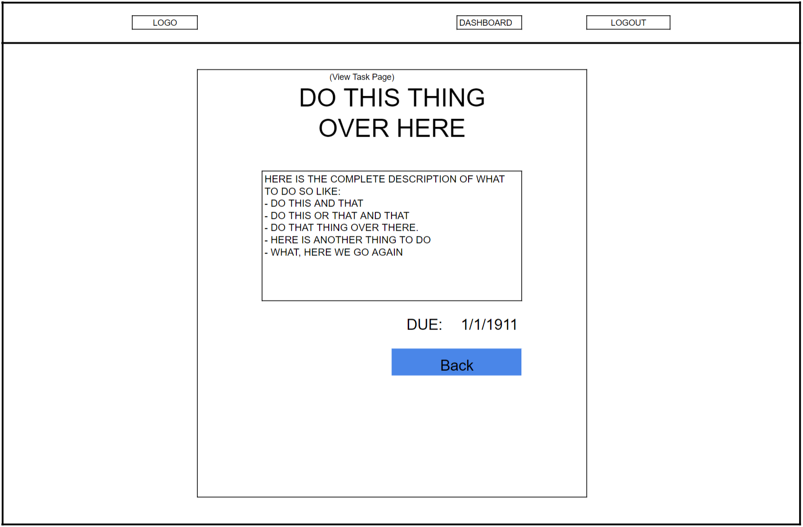

# Project: Pi Personal Assistance (Aka PiPA Pronounced Pie Pah)
##### (We are deployed on Azure at https://pipaweb.azurewebsites.net/)

## What is PiPA?
Virtual assistants are everywhere now, making life easier than ever for us. Our project serves as an assistant in a world that asks us to do so many things in so little time. By simply being able to say what you need, rather than taking the time to pull out your phone or planner and write it down, you’re offered a new level of freedom and increased daily efficiency, by providing users the ability to build to-do lists.

We accomplished this by utilizing the Azure Cognitive Services library for speech to text in combination with a full CRUD MVC application. 
A user will register (or log in) to our site and is able to see, create, update, or delete tasks. In addition to this MVC ability, if a user -----MIKE F FILL IN THIS INFO ABOUT HOW THE SPEECH TEXT PART WORKS----- 


## Tools Used
- Microsoft Visual Studio Community 2017 (Version 15.9.4)
- C#
- ASP.Net Core
- Entity Framework
- MVC
- xUnit
- Azure
- Bulma
- Azure Cognitive Services

## Getting Started
Clone this repository to your local machine.
```
$ git clone -------Fill this in after we move from ADO---------------
```
Utilize dotnet CLI or Visual Studio, to build the solution. The dotnet tools will automatically restore any NuGet dependencies. 

Before running the application, one will need to add the migraton and update their database for both DBContexts (ApplicationDbcontext and PADbcontext) SQL server of your choice.

## Usage
--------------THIS IS WHERE THE IMAGES OF THE SITE WILL GO----------

## Design
### Database Schema

ApplicationUser Table are additional fields for the .Net built in Identity tables. A User can have many Lists.
List Table are for lists a user can add tasks to. A List can have many TaskItems.
TaskItems Table are for tasks that can be added to Lists. 

### Model Properties and Requirements
#### List Model
```c#
public class Lists
    {
        public int ID { get; set; }
        public string UserID { get; set; }
        public string ListName { get; set; }
    }
```

#### Task Model
```c#
public class Tasks
    {
        public int ID { get; set; }
        public int ListID { get; set; }
        public string TaskName { get; set; }
        public string Description { get; set; }
        public DateTime DateCreated { get; set; }
        public DateTime PlannedDateComplete { get; set; }
        public DateTime CompletedDate { get; set; }
        public bool IsComplete { get; set; }
    }
```

### Wireframes
#### Home Page


#### Registration Page


#### Login Page


#### Dashboard Page


#### View Task Page


#### Edit Task Page


## Authors
Charles Clemens
Mike Filicetti
Michael Goseco
Andrew Hinojosa
Julie Ly


_______________template from Phil_____________________________
# ***Project README Example***
---------------------------------
---------------------------------
# Project A.M.A.N.D.A.
---------------------------------
## We are deployed on Azure!
[project url here]
---------------------------------
## Web Application
***[Explain your app, should be at least a paragraph. What does it do? Why should I use? Sell your product!]***
The web application consists of a frontend written in Razor views, HTML, CSS,
Bootstrap, Popper, and jQuery. The backend was written in C# using ASP.NET Core 2, Entity Framework Core, and the MVC framework.
An interface is provided to create new blog
posts, view existing blog posts, edit existing blog posts, delete existing
blog posts, and search by both keywords and usernames. All blog posts can be
enriched using Azure Language Services (part of Microsoft's Cognitive Services
suite), Bing Image API, and Parallel Dots (for automated tagging of posts via
key phrases detected within the post's body). Image enrichments can be added
based on the overall sentiment score (a range 0.0 - 1.0 related to the mood
of the post) and key phrases / keywords detected in the posts. Optionally, users
can choose to opt-out of these features for privacy or data collection concerns.
---------------------------------
## Tools Used
Microsoft Visual Studio Community 2017 (Version 15.5.7)
- C#
- ASP.Net Core
- Entity Framework
- MVC
- xUnit
- Bootstrap
- Azure
- Parallel Dots API
---------------------------------
## Recent Updates
#### V 1.4
*Added OAuth for MySpace* - 23 Jan 2003
---------------------------
## Getting Started
Clone this repository to your local machine.
```
$ git clone https://github.com/YourRepo/YourProject.git
```
Once downloaded, you can either use the dotnet CLI utilities or Visual Studio 2017 (or greater) to build the web application. The solution file is located in the AmandaFE subdirectory at the root of the repository.
```
cd YourRepo/YourProject
dotnet build
```
The dotnet tools will automatically restore any NuGet dependencies. Before running the application, the provided code-first migration will need to be applied to the SQL server of your choice configured in the /AmandaFE/AmandaFE/appsettings.json file. This requires the Microsoft.EntityFrameworkCore.Tools NuGet package and can be run from the NuGet Package Manager Console:
```
Update-Database
```
Once the database has been created, the application can be run. Options for running and debugging the application using IIS Express or Kestrel are provided within Visual Studio. From the command line, the following will start an instance of the Kestrel server to host the application:
```
cd YourRepo/YourProject
dotnet run
```
Unit testing is included in the AmandaFE/FrontendTesting project using the xUnit test framework. Tests have been provided for models, view models, controllers, and utility classes for the application.
---------------------------------
## Usage
***[Provide some images of your app with brief description as title]***
### Overview of Recent Posts

### Creating a Post

### Enriching a Post

### Viewing Post Details

---------------------------
## Data Flow (Frontend, Backend, REST API)
***[Add a clean and clear explanation of what the data flow is. Walk me through it.]***

---------------------------
## Data Model
### Overall Project Schema
***[Add a description of your DB schema. Explain the relationships to me.]***

---------------------------
## Model Properties and Requirements
### Blog
| Parameter | Type | Required |
| --- | --- | --- |
| ID  | int | YES |
| Summary | string | YES |
| Content | string | YES |
| Tags | string(s) | NO |
| Picture | img jpeg/png | NO |
| Sentiment | float | NO |
| Keywords | string(s) | NO |
| Related Posts | links | NO |
| Date | date/time object | YES |
### User
| Parameter | Type | Required |
| --- | --- | --- |
| ID  | int | YES |
| Name/Author | string | YES |
| Posts | list | YES |
---------------------------
## Change Log
***[The change log will list any changes made to the code base. This includes any changes from TA/Instructor feedback]***
1.4: *Added OAuth for MySpace* - 23 Jan 2003
1.3: *Changed email handler to Alta Vista, fixed issue with styling on Netscape Navigator browser.* - 21 Dec 1999
1.2: *Fixed bug where pages would not load due to temp data* - 16 Jun 1998
1.1: *Added ability for user to change photos on a post* - 12 May 1998
------------------------------
## Authors
Albus Dumbbledore
Igor Karkaroff
Minerva McGonagall
Leta Lestrange
Gellert Grindelwald
------------------------------
For more information on Markdown: https://www.markdownguide.org/cheat-sheet


