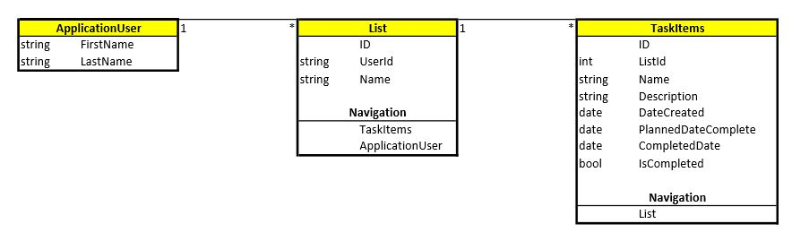

# Pi Personal Assistance (Aka PiPA)

## PiPA Team Members: Charles Clemens, Mike Filicetti, Michael Goseco, Andrew Hinojosa, Julie Ly

### Database Schema

ApplicationUser Table are additional fields for the .Net built in Identity tables. A User can have many Lists.
List Table are for lists a user can add tasks to. A List can have many TaskItems.
TaskItems Table are for tasks that can be added to Lists. 
