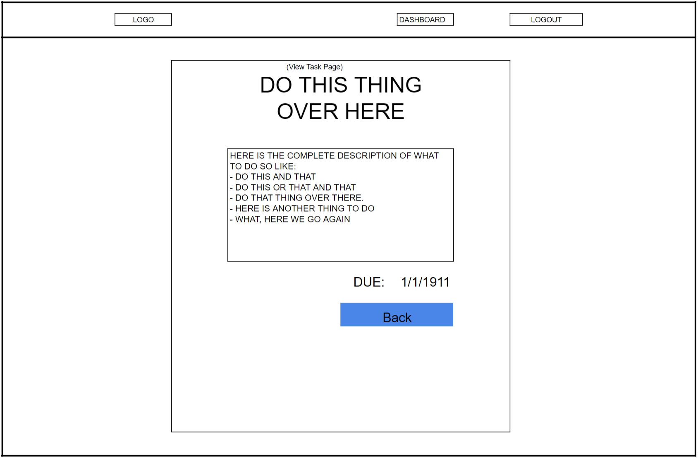
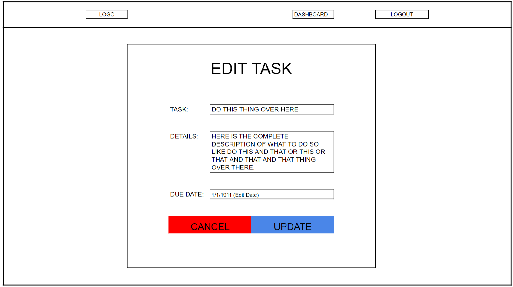

# Project: Pi Personal Assistance (Aka PiPA Pronounced Pie Pah)
##### (We are deployed on Azure at https://pipaweb.azurewebsites.net/)

## What is PiPA?
Virtual assistants are everywhere now, making life easier than ever for us. Our project serves as an assistant in a world that asks us to do so many things in so little time. By simply being able to say what you need, rather than taking the time to pull out your phone or planner and write it down, you’re offered a new level of freedom and increased daily efficiency, by providing users the ability to build to-do lists.

We accomplished this by utilizing the Azure Cognitive Services library for speech to text in combination with a full CRUD MVC application. 
A user will register (or log in) to our site and is able to see, create, update, or delete tasks. In addition to this MVC ability,  we created a console application which runs on a secondary device. The Cognitive Services library allows us to persist new tasks to our Tasks table within our Azure database.
In addition to verbally adding tasks, users have the ability to create, view, edit, or delete tasks from the user interface. 

## Tools Used
- Microsoft Visual Studio Community 2017 (Version 15.9.4)
- C#
- ASP.Net Core
- Azure Cognitive Services
- Entity Framework
- MVC
- xUnit
- Azure
- Bulma

## Getting Started
Clone this repository to your local machine.
```
$ git clone -------Fill this in after we move from ADO---------------
```
Utilize dotnet CLI or Visual Studio, to build the solution. The dotnet tools will automatically restore any NuGet dependencies. 

Before running the application, one will need to add the migraton and update their database for both DBContexts (ApplicationDbcontext and PADbcontext) SQL server of your choice.

## Usage
### Home Page


### Register Page


### Login Page


### Tasks Page


### Create Task Page


### Edit Task Page


## Design
### Database Schema

ApplicationUser Table are additional fields for the .Net built in Identity tables. A User can have many Lists.
List Table are for lists a user can add tasks to. A List can have many TaskItems.
TaskItems Table are for tasks that can be added to Lists. 

### Model Properties and Requirements
#### List Model
```c#
public class Lists
    {
        public int ID { get; set; }
        public string UserID { get; set; }
        public string ListName { get; set; }
    }
```

#### Task Model
```c#
public class Tasks
    {
        public int ID { get; set; }
        public int ListID { get; set; }
        public string TaskName { get; set; }
        public string Description { get; set; }
        public DateTime DateCreated { get; set; }
        public DateTime PlannedDateComplete { get; set; }
        public DateTime CompletedDate { get; set; }
        public bool IsComplete { get; set; }
    }
```

### Wireframes
#### Home Page


#### Registration Page


#### Login Page


#### Dashboard Page


#### View Task Page


#### Edit Task Page


## Authors
Charles Clemens
Mike Filicetti
Michael Goseco
Andrew Hinojosa
Julie Ly